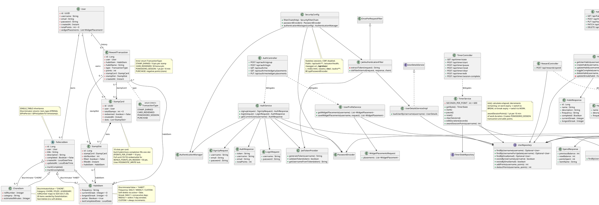

# Flowty UML Diagram

```plantuml
@startuml Flowty

' ======== ENUMERATIONS ========

enum TimerMode {
    WORK
    BREAK
}

' ======== DOMAIN ENTITIES ========

abstract class ToDoListItem {
    - id : Long
    - user : User
    - title : String
    - description : String
    - completed : Boolean = false
    - createdAt : LocalDateTime
    - updatedAt : LocalDateTime
    + markComplete()
    + markIncomplete()
}

class User {
    - id : UUID
    - username : String
    - email : String
    - password : String
    - createdAt : Instant
    - totalPoints : int = 0
    - widgetPlacements : List<WidgetPlacement>
}

class HabitItem extends ToDoListItem {
    - frequency : String
    - currentStreak : Integer = 0
    - longestStreak : Integer = 0
    - active : Boolean = true
    - lastCompletedDate : LocalDate
}

class ChoreItem extends ToDoListItem {
    - rollNumber : Integer
    - category : String
    - estimatedMinutes : Integer
}

class StampCard {
    - id : UUID
    - user : User
    - totalStamps : int = 0
    - redeemed : boolean = false
    - createdAt : Instant
    - slots : List<StampSlot>
}

class StampSlot {
    - id : Long
    - stampCard : StampCard
    - slotNumber : int
    - filled : boolean = false
    - filledAt : Instant
    - habitItem : HabitItem
}

class RewardTransaction {
    - id : Long
    - user : User
    - habitItem : HabitItem
    - habitName : String
    - type : TransactionType
    - points : int
    - stampCard : StampCard
    - stampSlot : StampSlot
    - createdAt : Instant
}

class TransactionType <<enum (inner)>> {
    STAMP_EARNED
    CARD_REDEEMED
    POMODORO_SESSION
    PURCHASE
}

class TimerState {
    - id : Long = 1
    - workDuration : int = 3600
    - workRemaining : int = 3600
    - breakDuration : int = 300
    - breakRemaining : int = 300
    - mode : TimerMode
    - running : boolean
    - completedSessions : int
    - lastTick : Instant
}

class WidgetPlacement {
    + widgetId : String
    + x : double
    + y : double
    + zIndex : int
}

' ======== ENTITY RELATIONSHIPS ========

User "1" -- "0..*" ToDoListItem : owns
User "1" -- "0..*" StampCard : earns
User "1" -- "0..*" RewardTransaction : history

ToDoListItem "1" <|-- "0..*" HabitItem : discriminator "HABIT"
ToDoListItem "1" <|-- "0..*" ChoreItem : discriminator "CHORE"

StampCard "1" *-- "0..*" StampSlot : slots
StampSlot "0..*" --> "0..1" HabitItem : habitItem

RewardTransaction .. TransactionType : type
RewardTransaction "0..*" --> "0..1" HabitItem : habitItem
RewardTransaction "0..*" --> "0..1" StampCard : stampCard
RewardTransaction "0..*" --> "0..1" StampSlot : stampSlot

' ======== REPOSITORIES ========

interface UserRepository {
    + findByUsername(username) : Optional~User~
    + findByUsernameForUpdate(username) : Optional~User~
    + findByEmail(email) : Optional~User~
    + existsByUsername(username) : boolean
    + existsByEmail(email) : boolean
    + addPoints(username, points) : int
    + deductPoints(username, points) : int
}

interface ToDoListItemRepository {
    + findChoreItemsByUserOrderByRollNumberAsc(user) : List~ChoreItem~
}

interface StampCardRepository {
    + findByUserOrderByCreatedAtDesc(user) : List~StampCard~
    + findFirstByUserAndRedeemedFalseOrderByCreatedAtDesc(user) : Optional~StampCard~
    + findByIdForUpdate(id) : Optional~StampCard~
}

interface RewardTransactionRepository {
    + findByUserOrderByCreatedAtDesc(user) : List~RewardTransaction~
}

interface TimerStateRepository {
}

' ======== SERVICES ========

class AuthService {
    + signup(request : SignUpRequest) : AuthResponse
    + login(request : LoginRequest) : AuthResponse
    + getCurrentUser(username) : AuthResponse
}

class UserProfileService {
    + getWidgetPlacements(username) : List~WidgetPlacement~
    + saveWidgetPlacements(username, request) : List~WidgetPlacement~
}

class HabitService {
    + getUserHabits(username) : List~HabitResponse~
    + createHabit(username, request) : HabitResponse
    + updateHabit(username, id, request) : HabitResponse
    + toggleComplete(username, id) : HabitResponse
    + deleteHabit(username, id)
    - updateStreak(habit : HabitItem)
}

class ChoreService {
    + getUserChores(username) : List~ChoreResponse~
    + createChore(username, request) : ChoreResponse
    + updateChore(username, choreId, request) : ChoreResponse
    + toggleComplete(username, choreId) : ChoreResponse
    + deleteChore(username, choreId)
}

class StampCardService {
    - MAX_SLOTS : int = 10
    - POINTS_PER_STAMP : int = 10
    - BONUS_POINTS_ON_REDEEM : int = 50
    + getUserStampCards(username) : List~StampCardResponse~
    + getUserRewardTransactions(username) : List~RewardTransactionResponse~
    + getOrCreateActiveCard(username) : StampCardResponse
    + addStamp(username, cardId) : StampCardResponse
    + addStampForHabitCompletion(username, habitId)
    + addStampForChoreCompletion(username, choreId)
    + redeemCard(username, cardId) : StampCardResponse
}

class RewardService {
    + awardPoints(user, points, type) : RewardTransaction
    + spendPoints(user, points, itemName) : RewardTransaction
    + getBalance(user) : int
    + getHistory(user) : List~RewardTransaction~
}

class TimerService {
    - SECONDS_PER_POINT : int = 600
    + getState() : TimerState
    + start()
    + pause()
    + reset()
    + clearSessions()
    + editDuration(seconds)
    + awardSessionPoints(username) : int
}

' ======== CONTROLLERS ========

class AuthController {
    + POST /api/auth/signup
    + POST /api/auth/login
    + GET /api/auth/me
    + GET /api/auth/me/widget-placements
    + PUT /api/auth/me/widget-placements
}

class HabitController {
    + GET /api/habits
    + POST /api/habits
    + PUT /api/habits/{id}
    + PATCH /api/habits/{id}/toggle
    + DELETE /api/habits/{id}
}

class ChoreController {
    + GET /api/chores
    + POST /api/chores
    + PATCH /api/chores/{id}/complete
}

class StampCardController {
    + GET /api/stampcards
    + GET /api/stampcards/active
    + GET /api/stampcards/transactions
    + POST /api/stampcards/{cardId}/stamp
    + POST /api/stampcards/{cardId}/redeem
}

class RewardController {
    + POST /api/rewards/spend
}

class TimerController {
    + GET /api/timer/state
    + POST /api/timer/start
    + POST /api/timer/pause
    + POST /api/timer/reset
    + POST /api/timer/clear
    + POST /api/timer/edit
    + POST /api/timer/session-complete
}

' ======== DTOS ========

class SignUpRequest {
    + username : String
    + email : String
    + password : String
}

class LoginRequest {
    + username : String
    + password : String
}

class AuthResponse {
    + token : String
    + username : String
    + email : String
    + totalPoints : int
}

class WidgetPlacementsRequest {
    + placements : List~WidgetPlacement~
}

class HabitRequest {
    + name : String
    + description : String
    + frequency : String
}

class HabitResponse {
    + id : Long
    + name : String
    + description : String
    + frequency : String
    + completed : Boolean
    + currentStreak : Integer
    + longestStreak : Integer
}

class ChoreRequest {
    + description : String
    + rollNumber : Integer
    + category : String
}

class ChoreResponse {
    + id : Long
    + rollNumber : Integer
    + description : String
    + category : String
    + completed : Boolean
}

class StampCardResponse {
    + id : UUID
    + totalStamps : int
    + redeemed : boolean
    + slots : List~StampSlotResponse~
}

class StampSlotResponse {
    + slotNumber : int
    + filled : boolean
}

class RewardTransactionResponse {
    + id : Long
    + type : String
    + points : int
    + habitName : String
    + createdAt : String
}

class SpendRequest {
    + points : int
    + itemName : String
}

class SpendResponse {
    + previousBalance : int
    + newBalance : int
    + pointsSpent : int
    + itemName : String
}

class TimerStateDto {
    + workDuration : int
    + workRemaining : int
    + breakDuration : int
    + breakRemaining : int
    + mode : TimerMode
    + running : boolean
    + completedSessions : int
    + timerDisplay : String
    + progress : double
    + isBreak : boolean
    + from(state : TimerState) : TimerStateDto
}

' ======== SERVICE DEPENDENCIES ========

AuthService --> UserRepository
AuthService --> JwtTokenProvider
AuthService --> PasswordEncoder
AuthService --> AuthenticationManager
AuthService --> SignUpRequest
AuthService --> LoginRequest
AuthService --> AuthResponse

UserProfileService --> UserRepository
UserProfileService --> WidgetPlacementsRequest

HabitService --> ToDoListItemRepository
HabitService --> UserRepository
HabitService --> StampCardService
HabitService --> HabitRequest
HabitService --> HabitResponse

ChoreService --> ToDoListItemRepository
ChoreService --> UserRepository
ChoreService --> StampCardService
ChoreService --> ChoreRequest
ChoreService --> ChoreResponse

StampCardService --> StampCardRepository
StampCardService --> RewardTransactionRepository
StampCardService --> UserRepository
StampCardService --> ToDoListItemRepository
StampCardService --> StampCardResponse
StampCardService --> StampSlotResponse
StampCardService --> RewardTransactionResponse

RewardService --> RewardTransactionRepository
RewardService --> UserRepository
RewardService --> SpendRequest
RewardService --> SpendResponse

TimerService --> TimerStateRepository
TimerService --> UserRepository
TimerService --> RewardTransactionRepository

' ======== CONTROLLER DEPENDENCIES ========

AuthController ..> AuthService : delegates
AuthController ..> UserProfileService : delegates
HabitController ..> HabitService : delegates
ChoreController ..> ChoreService : delegates
StampCardController ..> StampCardService : delegates
RewardController ..> RewardService : delegates
RewardController --> UserRepository
TimerController ..> TimerService : delegates

' ======== SECURITY ========

class JwtTokenProvider {
    + generateToken(username) : String
    + validateToken(token) : boolean
    + getUsernameFromToken(token) : String
}

class JwtAuthenticationFilter extends OncePerRequestFilter {
    - extractToken(request) : String
    + doFilterInternal(request, response, chain)
}

class UserDetailsServiceImpl implements UserDetailsService {
    + loadUserByUsername(username) : UserDetails
}

class SecurityConfig {
    + filterChain(http) : SecurityFilterChain
    + passwordEncoder() : PasswordEncoder
    + authenticationManager(config) : AuthenticationManager
}

class PasswordEncoder {
}

class AuthenticationManager {
}

JwtAuthenticationFilter --> JwtTokenProvider
JwtAuthenticationFilter --> UserDetailsServiceImpl
UserDetailsServiceImpl --> UserRepository
SecurityConfig --> JwtAuthenticationFilter
SecurityConfig --> PasswordEncoder
SecurityConfig --> AuthenticationManager

' ======== CONFIG ========

class CorsConfig {
}

class SchedulingConfig {
}

class GlobalExceptionHandler {
}

class DataInitializer implements CommandLineRunner {
    + run(args : String...)
}

class FlowtyApplication {
    + main(args : String[])
}

DataInitializer --> UserRepository
DataInitializer --> ToDoListItemRepository
DataInitializer --> PasswordEncoder

' ======== NOTES - ENTITIES ========

note top of ToDoListItem
  SINGLE_TABLE inheritance.
  Discriminator column: item_type (STRING).
  @PrePersist / @PreUpdate for timestamps.
end note

note right of HabitItem
  DiscriminatorValue = "HABIT".
  Frequency: DAILY / WEEKLY / CUSTOM.
  Soft-delete via active = false.
  Streak: DAILY = consecutive days;
  WEEKLY = within 7-day window;
  CUSTOM = always increments.
end note

note right of ChoreItem
  DiscriminatorValue = "CHORE".
  Category: CHORE, STUDY, LEGENDARY.
  rollNumber maps to D20 slot (1–20).
  20 items seeded by DataInitializer.
  Hard delete (no soft-delete).
end note

note bottom of StampCard
  10 slots per card.
  Each habit/chore completion fills one slot
  (POINTS_PER_STAMP = 10 pts).
  Full card (10/10) redeemable for
  BONUS_POINTS_ON_REDEEM = 50 pts.
  Uses PESSIMISTIC_WRITE lock.
end note

note right of RewardTransaction
  Inner enum TransactionType:
  STAMP_EARNED: 10 pts per stamp
  CARD_REDEEMED: 50 bonus pts
  POMODORO_SESSION: 1 pt per 10 min
  PURCHASE: negative points (store)
end note

note bottom of TimerState
  Singleton row (id=1). Not user-scoped.
  Defaults: 60 min work, 5 min break.
  Server-side state; frontend runs
  independent timer for display ticks.
end note

' ======== NOTES - SERVICES ========

note right of HabitService
  toggleComplete() → updateStreak() →
  StampCardService.addStampForHabitCompletion()
  deleteHabit() is soft (active = false).
end note

note right of ChoreService
  toggleComplete() toggles boolean,
  calls StampCardService.addStampForChoreCompletion().
  deleteChore() is hard delete.
end note

note right of TimerService
  tick(): calculates elapsed, decrements
  remaining; on work expiry → switch to
  BREAK; on break expiry → switch to WORK.

  awardSessionPoints(): 1 pt per 10 min
  of work duration. Creates POMODORO_SESSION
  transaction and adds points.
end note

' ======== NOTES - SECURITY & CONFIG ========

note bottom of SecurityConfig
  Stateless sessions. CSRF disabled.
  Public: /api/auth/**, /actuator/health,
  /swagger-ui/**, /api-docs/**,
  /, /index.html, /assets/**, /src/**, /audio/**.
  BCryptPasswordEncoder.
end note

note bottom of DataInitializer
  Seeds demo user (demo / password)
  with 20 chores:
  #1–14: CHORE, #15–19: STUDY,
  #20: LEGENDARY (free choice).
end note

' ======== FRONTEND ========

component AuthProvider [
    AuthProvider (React Context)
    --
    user / token / isLoading
    login() / signup() / logout() / refreshUser()
    localStorage persistence
]

component ThemeProvider [
    ThemeProvider
]

component ProtectedRoute [
    ProtectedRoute
    --
    Redirects to /login if no token
]

component Login [
    Login Page (/login)
]

component SignUp [
    SignUp Page (/signup)
]

component Dashboard [
    Dashboard Page (/)
    --
    Drag-and-drop widget canvas (1366x638)
    Selectable background images
    Widget placements persisted to server
]

package "API Layer (axios)" {
    component apiClient [
        axios client (/api)
        --
        Bearer token interceptor
        401/403 → redirect /login
    ]

    component authAPI [
        auth.ts
    ]

    component habitsAPI [
        habits.ts
    ]

    component choresAPI [
        chores.ts
    ]

    component stampCardsAPI [
        stampCards.ts
    ]

    component rewardsAPI [
        rewards.ts
    ]

    component timerAPI [
        timer.ts
    ]
}

package "Dashboard Widgets" {
    component PomodoroTimer [
        PomodoroTimer
        --
        SVG progress ring
        Start/Pause/Reset
        Session complete POST
    ]

    component HabitList [
        HabitList
        --
        Streak indicators
    ]

    component ToDoList [
        ToDoList (Chores)
        --
        D20 roll animation
    ]

    component Stampbook [
        Stampbook
        --
        2x5 slot grid + progress bar
    ]

    component ChoreTable [
        ChoreTable
        --
        Static D20 reference table
    ]

    component D20 [
        D20 (SVG die)
    ]

    component WhiteNoisePlayer [
        WhiteNoisePlayer
        --
        Local audio playback
        5 sounds via localStorage
    ]

    component Journal [
        Journal
    ]

    component CustomizationStore [
        CustomizationStore
        --
        Background & theme selection
    ]

    component ProfileSettings [
        ProfileSettings
    ]
}

AuthProvider --> authAPI : login/signup/getMe/widgets
authAPI --> apiClient
habitsAPI --> apiClient
choresAPI --> apiClient
stampCardsAPI --> apiClient
rewardsAPI --> apiClient
timerAPI --> apiClient

Dashboard *-- PomodoroTimer
Dashboard *-- HabitList
Dashboard *-- ToDoList
Dashboard *-- Stampbook
Dashboard *-- ChoreTable
Dashboard *-- D20
Dashboard *-- WhiteNoisePlayer
Dashboard *-- Journal

HabitList --> habitsAPI
ToDoList --> choresAPI
Stampbook --> stampCardsAPI
PomodoroTimer --> timerAPI
CustomizationStore --> rewardsAPI

@enduml
```